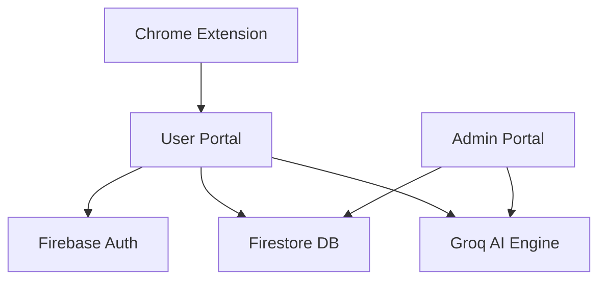

# 🚀 SkillBridge | AI-Powered Career Ecosystem

**SkillBridge** is a high-fidelity, production-grade career platform designed to bridge the gap between candidates and their dream roles using advanced AI. It features a dual-portal architecture with a dedicated **User Experience** and a comprehensive **Admin Control Center**.

---

## 🌟 Core Features

### 🤖 AI-Driven Intelligence
*   **Smart Resume Analysis**: Instant ATS scoring and keyword gap analysis using Llama 3.1 (Groq API).
*   **AI Interview Coach**: Dynamic behavioral and technical interview simulation tailored to specific job roles.
*   **Magic Fill Extension**: A Chrome extension that autonomously fills job applications on LinkedIn and Indeed.
*   **Career Roadmap**: Personalized learning paths generated based on identified skill gaps.

### 📊 Professional Dashboards
*   **User Portal**: Real-time job matching, application tracking (Kanban), and personalized analytics.
*   **Admin Portal**: Comprehensive system audit tools, user churn risk analysis (AI-predicted), and token usage monitoring.

### 📱 Premium UX/UI
*   **Ultra-Responsive**: Seamless experience across Desktop, Tablet, and Mobile.
*   **Modern Aesthetics**: Built with a sleek dark-mode design system, glassmorphism, and smooth micro-animations.
*   **Command Palette**: Global `Cmd+K` search for instant navigation across the platform.

---

## 🛠️ Technical Stack

*   **Frontend**: React.js 18, Vite, Tailwind CSS, Framer Motion
*   **Backend & Auth**: Firebase (Firestore, Auth, Storage)
*   **AI Engine**: Groq SDK (Llama 3.1 8B/70B Models)
*   **Charts**: Recharts (High-performance data visualization)
*   **Deployment**: Vercel (CI/CD Pipeline)

---

## 🏗️ Architecture

---

## 📈 Platform Audit (Admin)

The Admin Portal (`/admin`) provides deep insights into the platform's health:
*   **Token Auditor**: Track AI costs and prompt efficiency.
*   **User Heatmap**: Real-time geographic distribution of active users.
*   **Churn Predictor**: Identifies users inactive for > 7 days to trigger retention workflows.

---

## 📄 License
This project is licensed under the MIT License.

---

*Built for the future of work.*
